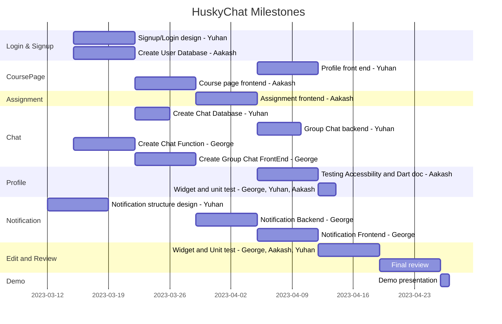

```mermaid
gantt
    title HuskyChat Milestones
    dateFormat  YYYY-MM-DD

%% Do we need to use milestone format instead of this ?
%% I create the extra section for the buffer week, do you prefer to
%% put it into other sections?


    section Login & Signup
    Signup/Login design - Yuhan            :a1, 2023-03-15,7d
    Create User Database - Aakash     :a2,2023-03-15,7d
    %% buffer day: a3,2023-04-12,2d
    section CoursePage
    Profile front end - Yuhan       :2023-04-05  , 7d
    Course page frontend - Aakash       :2023-03-22  , 7d

    %% buffer day: a4, after a3,2d
    section Assignment
    Assignment frontend - Aakash : 2023-03-29,7d
    section Chat
    Create Chat Database - Yuhan       :2023-03-22  , 4d
    Group Chat backend - Yuhan: 2023-04-05, 5d
    Create Chat Function - George: 2023-03-15, 7d
    Create Group Chat FrontEnd - George: 2023-03-22, 7d


    section Profile

    Testing Accessbility and Dart doc - Aakash :2023-04-05,7d
    Widget and unit test - George, Yuhan, Aakash: 2023-04-12,2d

    section Notification
    Notification structure design - Yuhan     :2023-03-12  , 7d

    Notification Backend - George: 2023-03-29, 7d
    Notification Frontend - George: 2023-04-05, 7d

    section Edit and Review
    Widget and Unit test - George, Aakash, Yuhan: 2023-04-12, 2023-04-19
    Final review: a3,2023-04-19,7d

    section Demo
    Demo presentation: after a3,1d
```
