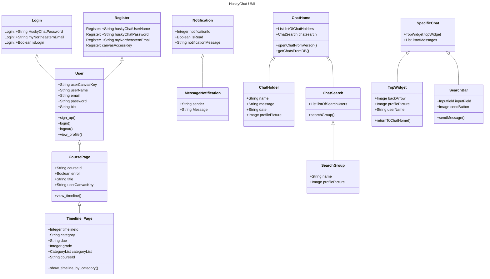

```mermaid

---
title: HuskyChat UML
---

classDiagram

     User <|-- CoursePage
     User: +String userCanvasKey
     User: +String userName
     User: +String email
     User: +String password
     User: +String bio

     User: +sign_up ()
     User: +login ()
     User: +logout ()
     User: +view_profile() 

    class Login {
    Login: +String HuskyChatPassword
    Login: +String myNortheasternEmail
    Login: +Boolean isLogin

    }

    class Register{
      Register: +String huskyChatUserName
      Register: +String huskyChatPassword
      Register: +String myNortheasternEmail
      Register: canvasAccessKey

    }

     Login <|-- User
     Register <|-- User
     Notification <|-- MessageNotification

       Notification:  +Integer notificationId
       Notification:  +Boolean isRead
       Notification:  +String notificationMessage


     class MessageNotification {
       +String sender
       +String Message
     }

     CoursePage <|-- Timeline_Page
     CoursePage : +String courseId
     CoursePage : +Boolean enroll
     CoursePage : +String title
     CoursePage : +String userCanvasKey

     CoursePage: +view_timeline()
     class Timeline_Page{

         +Integer timelineId
         +String category
         +String due
         +Integer grade
         +CategoryList categoryList
         +String courseId

         +show_timeline_by_category()
     }


    ChatHome <|-- ChatHolder
    ChatHome <|-- ChatSearch
    ChatHome: +List listOfChatHolders
    ChatHome: +ChatSearch chatsearch
    ChatHome: +openChatFromPerson()
    ChatHome: +getChatsFromDB()

    class ChatHolder{
      +String name
      +String message
      +String date
      +Image profilePicture
    }

    ChatSearch: +List listOfSearchUsers
    ChatSearch: +searchGroup()
    ChatSearch <|-- SearchGroup
    class SearchGroup{
      +String name
      +Image profilePicture
    }

    SpecificChat <|-- TopWidget
    SpecificChat: +TopWidget topWidget
    SpecificChat: +List listofMessages
    SpecificChat <|-- SearchBar

    class SearchBar{
      +Inputfield inputField
      +Image sendButton
      +sendMessage()
    }

    class TopWidget{
      +Image backArrow
      +Image profilePicture
      +String userName
      +returnToChatHome()
    }

```
